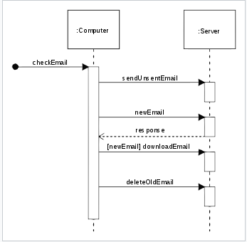

**Milestone 1 contents** due: Friday October 30, 4:59pm
- Brief description of your planned program analysis and/or visualisation ideas.
- Notes of any important changes/feedback from TA discussion
- Any planned follow-up tasks or features still to design

We have two ideas in mind for our project idea.  

1. UML Class Diagram visualiser:  
Given a source code directory (or github repo) written in Java, our program will spew out an appropriate UML class diagram-model of the class structure and its relations with each other.  

2. UML Sequence Diagram visualizer:
Given a source code directory (or github repo) written in Java, our program will run the source program and generate a sequence diagram ex  
  

Some useful feedback from our discussion with the TA is that we should put some more emphasis on the visualization of our analysis; it would be beneficially to display a dynamic chart rather than a static one.  Also, we should also come up with new ways of adding complexity to both our project ideas.

Our followup from this milestone is to sit on creating a project idea over the weekend or add more specifications to our existing ideas and meet on Monday for a group discussion.  
 

**Milestone 2 contents** due: Friday November 6, 4:59pm
- Planned division of main responsibilities between team members
- Roadmap for what should be done when
- Summary of progress so far

Roadmap: (template)
| Due Date   | Tasks          | Responsible  |
| -----------|----------------| -----|
| date 1     | task 1         | James |
| date 2     | task 2         | Andy, Juan, James |
| date 3     | task 3         | Mandy, John  |
| date 4     | task 4         | Mandy, John |
| date 5     | task 5         | Andy, Juan, James |
| date 6     | task 6         | Mandy, John |
| date 7     | task 7         | James, Juan |
| date 8     | task 8         | Andy, Juan, James |  
| date 9     | task 9         | Mandy, Andy, Juan, James |
| date 10    | task 10        | John |

**Milestone 3 contents** due: Friday November 13, 4:59pm
- Mockup of concrete language design (as used for your first user study)
- Notes about first user study 
- Any changes to original language design

**Milestone 4 contents** due: Friday November 20, 4:59pm
- Status of implementation
- Plans for final user study 
- Planned timeline for the remaining days

**Project Completion** due: Monday November 30, 8:59am

