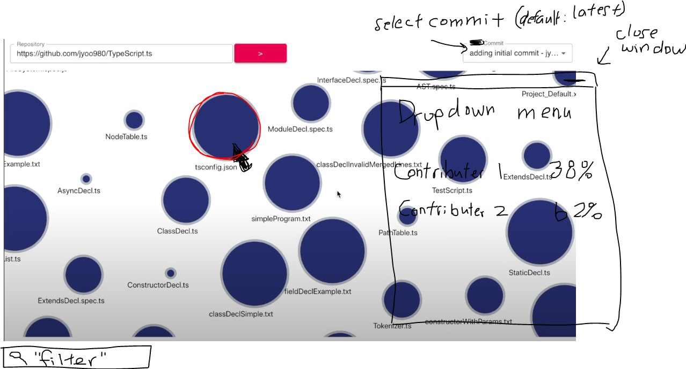
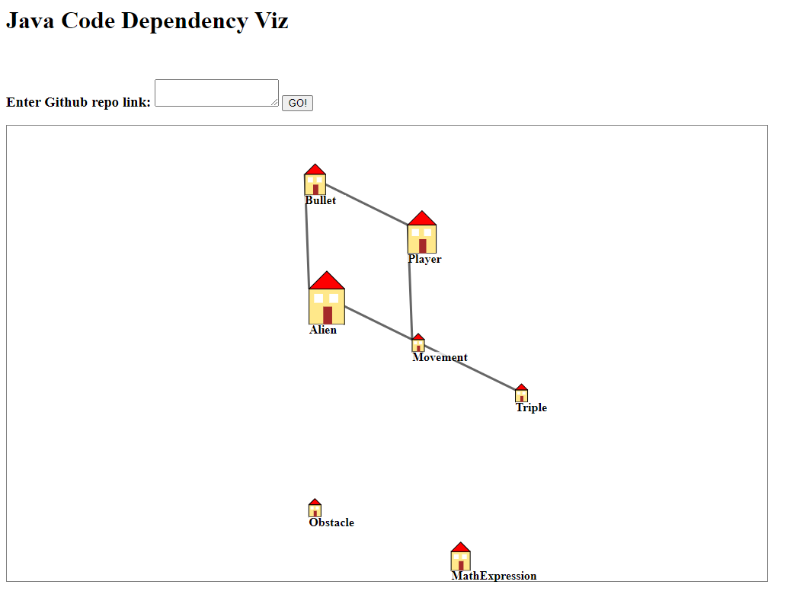

**Milestone 1 contents** due: Friday October 30, 4:59pm
- Brief description of your planned program analysis and/or visualisation ideas.
- Notes of any important changes/feedback from TA discussion
- Any planned follow-up tasks or features still to design

We have two ideas in mind for our project idea.  

1. UML Class Diagram visualiser:  
Given a source code directory (or github repo) written in Java, our program will spew out an appropriate UML class diagram-model of the class structure and its relations with each other.  

2. UML Sequence Diagram visualizer:
Given a source code directory (or github repo) written in Java, our program will run the source program and generate a sequence diagram ex  
  

Some useful feedback from our discussion with the TA is that we should put some more emphasis on the visualization of our analysis; it would be beneficially to display a dynamic chart rather than a static one.  Also, we should also come up with new ways of adding complexity to both our project ideas.

Our followup from this milestone is to sit on creating a project idea over the weekend or add more specifications to our existing ideas and meet on Monday for a group discussion.  
 

**Milestone 2 contents** due: Friday November 6, 4:59pm
- Planned division of main responsibilities between team members
- Roadmap for what should be done when
- Summary of progress so far

Project Idea:  
Repository File Contributions Visualizer

Input: github repo  

  

Output: 
- “Nodes” of files or even folders 
- Click on folders to display inner files 
- Tree structure of files
- Size of circle depends on file size (# lines)

Features:
- Clicking on a node brings up / updates a dropdown menu that displays the “ownership” made by all contributors 
- Can have a bar chart instead of raw numbers for even better visualization 
- User can choose commit (defaults to latest one) from commit history

***Roadmap:*** 
| Due Date   | Tasks          | Responsible  |
| -----------|----------------| -----|
| Nov 10     | Front End: static page (UI elements) finished (use dummy data for nodes)     | Andy, Juan, John  |
| Nov 10     | Front End: pass field parameter (github repo) for Back End                   | Andy, Juan, John  |
| Nov 12     | User Study #1                                                                | Mandy, James |
| Nov 13     | Back End: API call and return nodes                                          | Mandy, James |
| Nov 16     | Front End: Load nodes from back end values                                   | Andy, Juan, John |
| Nov 20     | Front End: Drop-down menu contents finished                                  | Andy, Juan, John |
| Nov 26     | User Study #2                                                                | Andy, Juan |  
| Nov 27     | Front End: Commit selection                                                  | Mandy, Andy, Juan, James |
| Nov 30     | Video Editting                                                               | John |  

**Milestone 3 contents** due: Friday November 13, 4:59pm
- Mockup of concrete language design (as used for your first user study)
- Notes about first user study 
- Any changes to original language design

After numerous back and forth discussions and feedback from our TA, we have decided to revamp our project idea to visualize the UML class and depedencies of a Java repository.  To enhance visualization, we will represent these classes as "houses" with "roads" serving as edges to symbolize a dependency.

An example snippet of the visualization: 
  

In lieu of our new idea, we also had to update our roadmap:

***Roadmap:*** 
| Due Date   | Tasks          | Responsible  |
| -----------|----------------| -----|
| Nov 10     | Front End: pass field paramater (github repo) for Back End     | Andy, Juan, John  |
| Nov 11     | Java servlet                   | Andy |
| Nov 12     | Front End: static (UI elements) finished (use dummy data for nodes)          | Juan, John, (Andy) |
| Nov 13     | User Study #1                                                                | Mandy, James |
| Nov 15     | Back End: API call and return nodes (JSON object);   - GET (AST JSON object)   - POST (either a zip file, or get from github repo)                                                                           | Mandy, James |
| Nov 16     | Front End: Load nodes from back end values                                   | Andy, Juan, John |
| Nov 20     | Front End: Additional component (?) *enhance viz*                            | Andy, Juan, John |
| Nov 26     | User Study #2                                                                | Andy, Juan |  
| Nov 27     | Wrap up                                                                      | Mandy, Andy, Juan, James |
| Nov 30     | Video Editting                                                               | John |   
 
   
**User Study #1 Notes:** https://docs.google.com/document/d/1Q8jTLI_kAcJhpJ_UkJ9qyX2hBMSYgT-Pq0sFSg0Vt0c/edit?usp=sharing

**Milestone 4 contents** due: Friday November 20, 4:59pm
- Status of implementation
- Planned timeline for the remaining days
- Plans for final user study 

**Milestone Report:**  
We are on track with the roadmap in terms of implementation progress.  Since the last milestone, we finished connecting the GET requests with the github URLs to our front end, utilizing the github API to return project source directories.  We also implemented the back-end by adding the *javaparser* library which will provide us the AST structure of a provided java project.  

Our next big task is to organize the data we are interested with into an appropriate data structure to feed into our front end to display.  Afterwards, we can try and enhance the visualization of the front end with our feedback from our first round of user studies  (improve edges between nodes to represent relations, add more metadata into nodes including code smells, etc).  We will then conduct our final user studies and begin video editting for submission.  

For our final user study, we plan to have the project essetentially complete as reflected in our roadmap.  This way we hope to gain candid and percise feedback on any potential hindsights we may have missed.  Due to the timing of user study, we don't expect to implement any feature requests or fixes unless they are very small, as it will serve more as a retrospective guide and will be included in our video instead.  As for the precise user study task, we will focus on finding users with a basis of computer science knowledge, as our visualizor is quite technical, and non-cs users may not understand what is going on.  We plan on letting them test out their own personal repositories on github and comment on how the visualizor meets with their expectation.  

**Project Completion** due: Monday November 30, 8:59am

