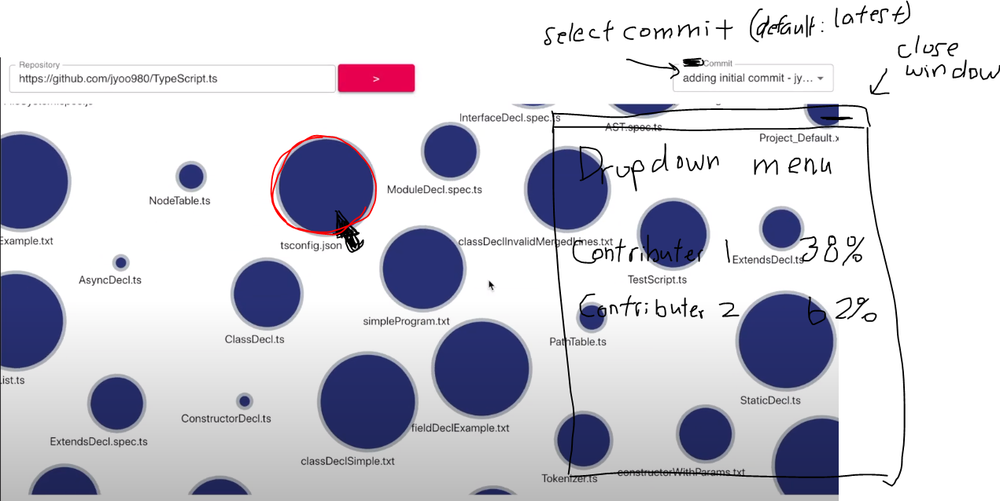

# CPSC 410 Project 2 Repository

This repository contains the code for group 6 project 2 Program analysis and visualization from CPSC410 2020WT1

## Configuring your environment

To start using this project, you need to get your computer configured so you can build and execute the code.

1. Clone your repository by running `git clone REPO_URL` from the command line. You can get the REPO_URL by clicking on the green button on your project repository page on GitHub.

1. [Install Node](https://nodejs.org/en/download/) After installing you should be able to execute `node -v` on the command line.

1. [Install http-server](https://www.npmjs.com/package/http-server) To be able to start a server locally

1. In terminal, run `http-server -p 8080` while in the project repository 

1. You can access it then in browser with `http://localhost:8080/`

## Project Details

Project Idea:  Repository File Contributions Visualizer

Input: github repo  
  

Output: 
- “Nodes” of files or even folders 
- Click on folders to display inner files 
- Tree structure of files
- Size of circle depends on file size (# lines)

Features:
- Clicking on a node brings up / updates a dropdown menu that displays the “ownership” made by all contributors 
- Can have a bar chart instead of raw numbers for even better visualization 
- User can choose commit (defaults to latest one) from commit history
