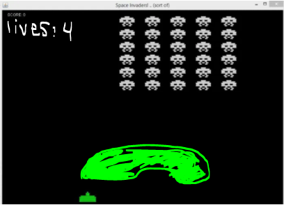
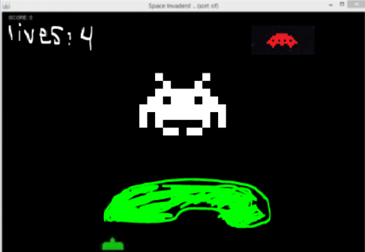

## Provided resources 
Alongside the grammar.MD file, user were given both textual and visual specifications of the custom space invaders game that their input 
string should generate using our DSL.

## User Study #1
Specificaitons: create a game with the following enemy waves, that also matches the photos provided  
### Wave 1:  
We would like the enemy movement to go left for 2000ms and then right for 3500ms and loop twice before changing it to go up for 4000ms, down for 3000ms and then right 3000ms
We would also like the enemies speed be a function of time: 4t+10  

### Wave 2:  
include a bonus (indicated as the red sprite in image below) which has speed of cos(t)+2 and movement of going left 2000ms and then going right 1500ms
Alien boss has no movement pattern  

### User 1:
#### User Feedback: 
- **What is your background (coding experience?)**  
Some coding in compsci classes as a compsci major  
- **How long did it take you to do the example above?**  
Half an hour
- **Would you say it was easy or difficult to learn the syntax for making the space invader game? If difficult, explain what made it difficult?**  
It was difficult in that it’s hard to read EBNF in general. There were also some small things I got stuck on with the syntax (mostly because I didn’t read the syntax). So I got stuck on repetition (i.e. curly brackets) and also the MOVEMENT grammar.
- **What did you like about the language?**  
I liked that I didn’t have to use a lot of commas because I feel like they can bloat the language a bit
I thought that the square brackets as optional was intuitive
- **What do you wish our language could do that it could not?**  
Declaring the spawn positions of players/enemies
Declaring sizes of enemies
The F(t) grammar made me want to define a time function in the variables and set that to SPEED as opposed to having the whole function in F(t)
Maybe ellipses (...) as repetition
- **Any other comments?**  
This was fun! Thanks :)

#### User Input: 
Wave 1)  
VARIABLES:  
PLAYER: HP=4 SPEED=700  
BLOCKADE: HP=5 SPAWN=1  
WAVE:  
[ALIEN HP=1 SPEED=4t+10 POINTS=20] SPAWN=5 ROWS=6  
MOVEMENT:   
LEFT= 2000 RIGHT=3500 LOOP=2  
UP=4000 DOWN=3000 RIGHT=3000  

Wave 2)  
VARIABLES:  
f(t) = cos(t) + 2  
PLAYER: HP=4, SPEED=700  
BLOCKADE: HP=5 SPAWN=1  
WAVE:  
[ALIENBOSS HP=15 POINTS=500] SPAWN=1 ROWS=1  
[BONUS HP=5 SPEED=f(t) POINTS=100] SPAWN=1 ROWS=1   
MOVEMENT: LEFT=2000 RIGHT=1500  

#### Notes: 
-User didn’t know that they could have more than one enemy. (from example is was yes but from what the language stated no   
-User was confused about Function restrictions/defining variables and using them in functions ex. A = 2000 then in function: 2cos(t)+A????  
-User got confused with MOVEMENTS ::= "MOVEMENT:" , {MOVEMENT}  

### User 2:
#### User Feedback: 
- **What is your background (coding experience?)**  
No coding experience. Undergraduate art student from Canada. 
- **How long did it take you to do the example above?**  
I tried to solve it for thirty minutes, but then I gave up.
- **Would you say it was easy or difficult to learn the syntax for making the space invader game? If difficult, explain what made it difficult?**  
I don’t understand the language of coding. 
- **What did you like about the language?**  
It looks concise, but due to my lack of coding understanding, it was difficult to understand. 
- **What do you wish our language could do that it could not?**  
Easier for non-computer science people to understand.
- **Any other comments?**  
Great game!

#### User Input: 
N/A, user gave up because it was too confusing

#### Notes: 
- User could understand what was happening on surface level and tried to attempt, but it was too difficult for non-coder to write the whole grammar out.  
- She tried writing some code out but was stuck on how variables worked  
